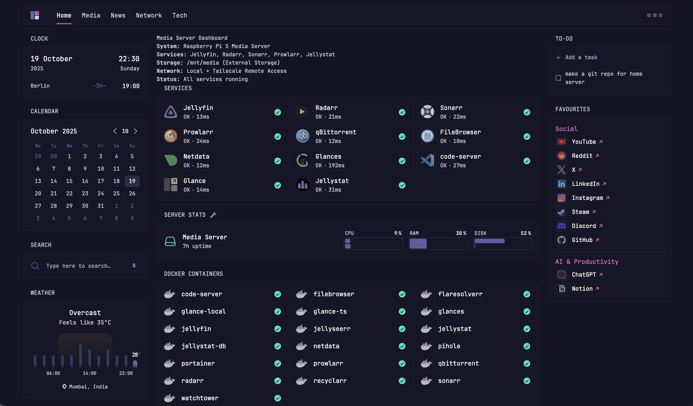

# 🏠 Pi Server - Complete Self-Hosted Media Center



A comprehensive self-hosted media center setup on **Raspberry Pi 5**, featuring a beautiful Glance dashboard, complete *arr media stack, and secure remote access via Tailscale. Perfect for personal use, family sharing, and as a foundation for expanding into a full NAS solution.

> *"This dashboard probably has nothing that hasn't been done before, but I'm sharing my config with the public so that someone else doesn't have to spend hours beautifying their dashboards."*
> 
> **— The motivation behind this project**

## 🌟 **Why This Setup?**

- **🔒 Privacy-First**: Complete control over your data and media
- **🌐 Remote Access**: Secure VPN capabilities via Tailscale (perfect for CGNAT situations)  
- **📱 Beautiful Dashboard**: Custom-configured Glance interface with modular widgets
- **🎬 Complete Media Stack**: Automated downloading, organizing, and streaming
- **🚀 Future-Ready**: Foundation for NAS, photo backup, and self-hosted alternatives
- **📖 Well-Documented**: Detailed guides so you don't spend hours configuring

## 📊 **Dashboard Features**

This setup features **dual Glance dashboards** - one optimized for local network access and another for remote Tailscale access. Each dashboard includes:

- **📈 Real-time Service Monitoring** - Live status of all containers
- **🎥 Media Statistics** - Jellyfin library stats and recent activity  
- **📊 System Metrics** - CPU, RAM, disk usage via Netdata integration
- **🌍 News & Entertainment** - RSS feeds, Reddit, YouTube, Twitch
- **🔗 Quick Access Links** - One-click access to all services
- **📅 Calendar & Weather** - Daily planning widgets
- **🐳 Docker Container Status** - Real-time container health monitoring

> **⚠️ Current Workaround**: Running two Glance instances with duplicated configs but different network bindings. This works but creates code duplication and maintenance overhead - looking for a more elegant solution!

## 🛠 **Hardware Setup**

- **Device**: Raspberry Pi 5 (ARM64)
- **Storage**: 2TB Seagate Portable Drive (external HDD)
- **Case**: Official Raspberry Pi 5 Case
- **Cooling**: Official Active Cooler
- **Network**: Behind CGNAT (solved with Tailscale)
- **Runtime**: 1+ week uptime, stable performance

## 🎯 **Use Cases**

### **Primary Functions**
- **🔐 VPN Server**: Secure remote access for family and friends
- **🎬 Media Streaming**: Personal Netflix with Jellyfin
- **📱 Remote Management**: Access home services from anywhere
- **💾 Future NAS**: Foundation for photo backup and file storage

### **Content Focus**
- **Movies & TV Shows**: Automated via Sonarr/Radarr
- **4K HEVC Content**: Optimized for Pi 5 streaming capabilities
- **Anime**: Specialized quality profiles via Recyclarr
- **Quality Over Quantity**: Focus on smaller, efficient file sizes

## 🚀 **Services Overview**

### **🎬 Media Stack**
| Service | Purpose | Port | Description |
|---------|---------|------|-------------|
| **Jellyfin** | Media Server | 8096 | Netflix-like interface for your content |
| **Sonarr** | TV Management | 8989 | Automated TV show downloading & organizing |
| **Radarr** | Movie Management | 7878 | Automated movie downloading & organizing |
| **Prowlarr** | Indexer Management | 9696 | Centralized indexer management for *arr apps |
| **qBittorrent** | Download Client | 8080 | Torrent client with web interface |
| **Jellyseerr** | Request Management | 5055 | User-friendly request system for media |
| **Flaresolverr** | Captcha Solver | 8191 | Bypasses Cloudflare protection for indexers |
| **Recyclarr** | Quality Management | - | Automated quality profiles and custom formats |
| **Jellystat** | Analytics | 8095 | Detailed Jellyfin usage statistics |
| **Watchtower** | Auto-Updates | - | Keeps all containers updated automatically |

### **📊 Monitoring & Management**
| Service | Purpose | Port | Description |
|---------|---------|------|-------------|
| **Glance Local** | Dashboard | 8280 | Local network optimized dashboard |
| **Glance Tailscale** | Dashboard | 8280 | Remote access optimized dashboard |
| **Pi-hole** | DNS Ad Blocker | 8081 | Network-wide ad blocking |
| **Netdata** | System Monitoring | 19999 | Real-time system performance metrics |
| **Glances** | System Overview | 61208 | Lightweight system monitoring |
| **Filebrowser** | File Management | 8085 | Web-based file manager |
| **Code-server** | VS Code | 8443 | VS Code in your browser |

## 🌐 **Network Architecture**

### **Local Access** (Your LAN IP)
- Direct access within home network
- Full bandwidth, no latency
- Glance Local dashboard optimized for LAN

### **Remote Access** (Your Tailscale IP)  
- Secure VPN tunnel via Tailscale
- Bypasses CGNAT limitations
- Glance Tailscale dashboard with remote-optimized widgets
- Shared with family/friends for VPN capabilities

## 📁 **Repository Structure**

```
pi-server/
├── 📄 README.md                    # This comprehensive guide
├── 🖼️ dashboard-screenshot.png      # Dashboard preview
├── ⚙️ .env.template                # Environment variables template
├── 🚫 .gitignore                   # Git ignore rules
├── 📜 LICENSE                      # MIT License
├── 📂 docker/                      # Active configurations only
│   ├── 🎛️ glance-local/            # Local network dashboard config
│   ├── 🌐 glance-ts/               # Tailscale dashboard config  
│   ├── ♻️ recyclarr/               # Quality management config
│   └── 📁 filebrowser/             # File browser settings
└── 📚 docs/                        # Detailed documentation
    ├── 🎛️ glance/                  # Dashboard configuration
    ├── 🎬 media-server/             # Media stack details
    ├── 🐳 portainer/               # Docker compose files
    ├── ⚙️ configuration/           # Individual service guides
    └── 🔧 troubleshooting/         # Common issues & solutions
```

## 🚀 **Quick Start**

### **Prerequisites**
- Raspberry Pi 5 with Raspberry Pi OS
- Docker & Docker Compose installed
- Portainer (recommended for stack management)
- Tailscale account (for remote access)
- External storage device

### **Installation**

> **⚠️ Important**: This repository contains my specific network configuration. You'll need to adapt it to your network setup.

1. **Clone Repository**
   ```bash
   git clone https://github.com/aditya-812/pi-server.git
   cd pi-server
   ```

2. **Adapt Network Configuration**
   ```bash
   # Find and replace my IPs with yours throughout the configs
   find docker/ -name "*.yml" -exec sed -i 's/192.168.29.160/YOUR_PI_IP/g' {} \;
   find docker/ -name "*.yml" -exec sed -i 's/100.80.146.24/YOUR_TAILSCALE_IP/g' {} \;
   
   # Update Portainer configs
   sed -i 's/192.168.29.160/YOUR_PI_IP/g' docs/portainer/*.yml
   sed -i 's/100.80.146.24/YOUR_TAILSCALE_IP/g' docs/portainer/*.yml
   ```

3. **Configure Environment**
   ```bash
   cp .env.template .env
   nano .env  # Add your API keys and network settings
   ```

4. **Deploy via Portainer**
   - Import the **modified** `docs/portainer/PORTAINER_MEDIA_STACK_CONFIG.yml`
   - Import the **modified** `docs/portainer/PORTAINER_MONITORING_STACK_CONFIG.yml`
   - Configure environment variables in Portainer
   - Deploy both stacks

5. **Access Your Dashboard**
   - **Local**: http://YOUR_PI_IP:8280
   - **Remote**: http://YOUR_TAILSCALE_IP:8280 (via Tailscale)

> **💡 Alternative**: Use this as a **reference configuration** and manually adapt the parts you need rather than direct cloning.

## 🎨 **Dashboard Highlights**

### **Modular Widget Design**
Each dashboard page is built from modular YAML files for easy customization:

- **📊 Home**: System overview, service status, quick links
- **🎬 Media**: Jellyfin stats, recent releases, YouTube feeds  
- **📰 News**: RSS feeds, Reddit, tech news aggregation
- **🌐 Network**: Tailscale devices, Pi-hole stats, uptime monitoring
- **💻 Tech**: GitHub releases, Hacker News, development feeds

### **Dual Network Strategy**
```yaml
# Local Network (glance-local)
ports:
  - "YOUR_PI_IP:8280:8080"  # LAN optimized

# Tailscale Network (glance-ts)  
ports:
  - "YOUR_TAILSCALE_IP:8280:8080"   # Remote optimized
```

> **Why Two Instances?** This is a **temporary workaround** for the local vs. remote access challenge. While functional, it creates code duplication and maintenance overhead. A more elegant solution would use dynamic configuration or environment-based URL switching.

## 🔧 **Advanced Configuration**

### **Quality Profiles (Recyclarr)**
- **4K HEVC Focus**: Smaller file sizes, Pi 5 optimized
- **Automated Sync**: Quality profiles sync with Radarr/Sonarr
- **Custom Formats**: Optimized for streaming performance

### **Hardware Acceleration**
- **Status**: Under development 🚧
- **Goal**: Jellyfin hardware decoding on Pi 5
- **Current**: Software transcoding (limited concurrent streams)

### **Performance Expectations**
- **Concurrent Streams**: Testing in progress
- **4K Content**: HEVC preferred for bandwidth efficiency
- **Transcoding**: Limited without hardware acceleration

## 📚 **Detailed Documentation**

### **🚀 Complete Setup Guide**
**New to self-hosting?** Start here for a comprehensive walkthrough from blank Raspberry Pi to fully functional media server:

- **[📋 Setup Overview](docs/setup/)** - Complete installation roadmap and preparation
- **[🍓 Phase 1: Operating System](docs/setup/01-operating-system.md)** - Ubuntu Server installation and configuration
- **[🔐 Phase 2: SSH & Remote Access](docs/setup/02-ssh-setup.md)** - Secure headless access setup
- **[👤 Phase 3: User & Permissions](docs/setup/03-user-permissions.md)** - User accounts and directory structure
- **[🐳 Phase 4: Docker Installation](docs/setup/04-docker-setup.md)** - Container platform setup
- **[📦 Phase 5: Portainer Deployment](docs/setup/05-portainer-setup.md)** - Web-based Docker management
- **[💾 Phase 6: Storage Configuration](docs/setup/06-storage-setup.md)** - External drive setup *(Coming Soon)*
- **[🎬 Phase 7: Media Stack Deployment](docs/setup/07-media-stack.md)** - Core media services *(Coming Soon)*

### **🎛️ Dashboard & Interface**
- **[Glance Dashboard Configuration](docs/glance/)** - Complete dashboard setup, widget customization, and dual-network configuration
- **[Portainer Stack Configurations](docs/portainer/)** - Docker Compose files for media and monitoring stacks

### **🎬 Media & Entertainment Services**
- **[Media Server Stack](docs/media-server/)** - Jellyfin, Sonarr, Radarr, Prowlarr, qBittorrent, Jellyseerr setup
- **[Recyclarr Quality Management](docs/configuration/recyclarr.md)** - Quality profiles and custom formats *(Coming Soon)*
- **[Jellyfin Configuration](docs/configuration/jellyfin.md)** - Hardware acceleration, libraries, users *(Coming Soon)*

### **📊 Monitoring & Management**
- **[Pi-hole DNS Setup](docs/configuration/pihole.md)** - Ad blocking and DNS configuration *(Coming Soon)*
- **[Netdata Monitoring](docs/configuration/netdata.md)** - System metrics and alerting *(Coming Soon)*
- **[Tailscale VPN Setup](docs/configuration/tailscale.md)** - Remote access configuration *(Coming Soon)*

### **🔧 System & Maintenance**
- **[Environment Variables Guide](docs/configuration/environment.md)** - Complete .env setup *(Coming Soon)*
- **[Backup & Recovery](docs/configuration/backup.md)** - Configuration and data backup strategies *(Coming Soon)*
- **[Troubleshooting Guide](docs/troubleshooting/)** - Common issues and solutions *(Coming Soon)*

## 🛣️ **Roadmap**

### **🚧 Current Development**
- [ ] Jellyfin hardware acceleration optimization
- [ ] Performance benchmarking (concurrent streams)
- [ ] Recyclarr quality profile refinement

### **🔮 Future Plans**
- [ ] **Elegant Dashboard Solution**: Replace dual Glance instances with dynamic configuration
- [ ] **Full NAS Capabilities**: File sharing, backup solutions
- [ ] **Photo Backup System**: Self-hosted Google Photos alternative
- [ ] **Additional Self-Hosted Apps**: Bitwarden, Nextcloud, etc.
- [ ] **Monitoring Improvements**: Grafana + Prometheus integration
- [ ] **Backup Strategy**: Automated configuration backups

## 🤝 **Contributing**

This repository serves as both a working configuration and a learning resource. Contributions welcome:

- **🐛 Bug Reports**: Issues with configurations
- **💡 Improvements**: Better widget designs, optimizations
- **📖 Documentation**: Clearer guides, additional use cases
- **🔧 Configurations**: Alternative setups, new integrations

## 💡 **Key Learnings & Tips**

### **Network Challenges**
- **CGNAT Solution**: Tailscale provides reliable remote access
- **Dual Dashboard Challenge**: Current workaround creates maintenance overhead - seeking better solution
- **Port Management**: Careful planning prevents conflicts

### **Configuration Philosophy**
- **Modular Design**: Separate YAML files for easy customization
- **Environment Variables**: Secure, flexible configuration management
- **Documentation First**: Save hours for future users

### **Performance Insights**
- **4K HEVC**: Best balance of quality and Pi 5 capabilities
- **Container Management**: Watchtower keeps everything updated
- **Resource Monitoring**: Essential for identifying bottlenecks

## 📄 **License**

MIT License - see [LICENSE](LICENSE) file for details.

---

## 🙏 **Acknowledgments**

- **Glance Community**: Amazing dashboard framework
- **TRaSH Guides**: Invaluable *arr configuration resources  
- **LinuxServer.io**: Excellent Docker images
- **Tailscale**: Seamless VPN solution
- **Raspberry Pi Foundation**: Incredible hardware platform

---

**⭐ If this setup helps you, please star the repository and share your own configurations!**